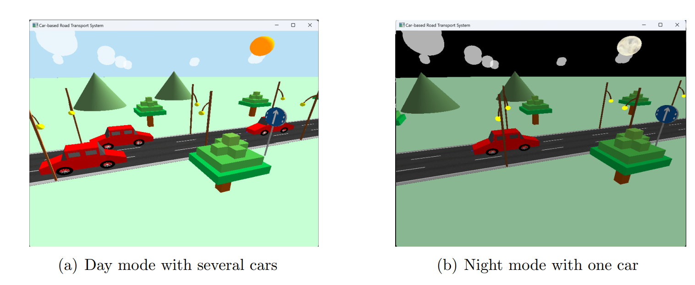
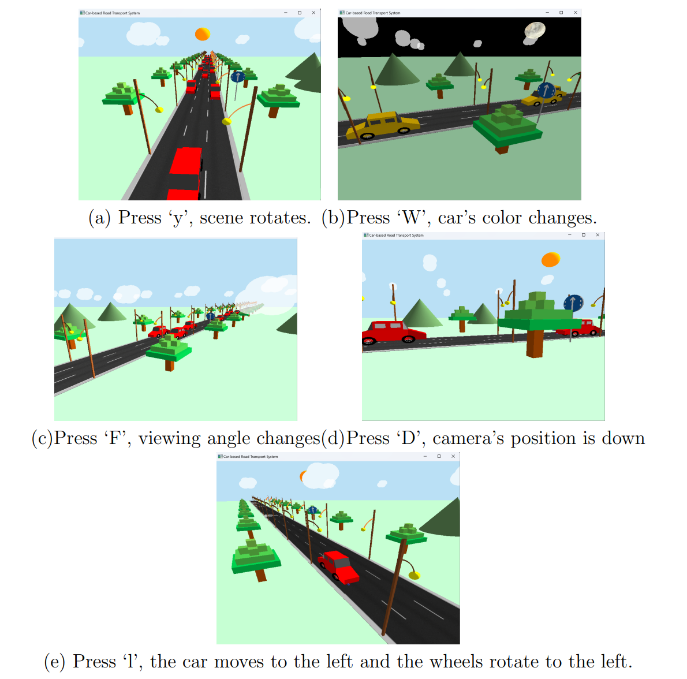
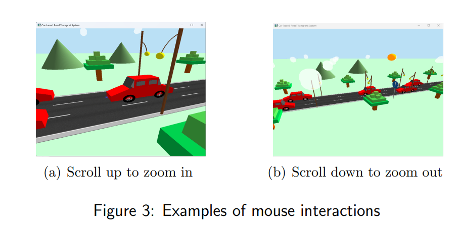
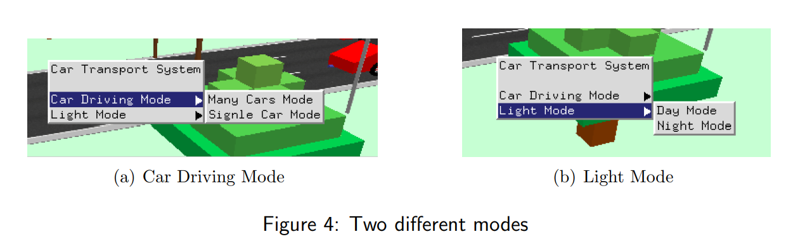

# OpenGL-3D-car
Test
=====
You will create a well-thought 3D scene, which is suitable to demonstrate your knowledge and skills in computer graphics. A key objective of the assignment is to make effective use of the graphics techniques 
and OpenGL functions covered in the module. In particular, you should consider the following in completing this assignment:

• A well-thought design of 3D scene with a number of static and moving objects (the scene, which is not necessarily very complex, but could still represent daily life, e.g., the train track used in the lab);

• A range of graphics techniques utilised in an appropriate manner, e.g., creation of geometry, hierarchical modelling, transformations, viewing and projection, lighting and materials, texture 
mapping, animation and interactions;

• Effective use of relevant OpenGL libraries in **freeglut** (no other OpenGL libraries to be used);

• Good programming practice (e.g., necessary comments and neat format of the code) – appropriately acknowledge sources used in your assignment work.

Introduction
=====

The whole explanation and interactions of keyboard and mouse can be seen in the [report](https://github.com/CynthiaChen03/Computer-Graphics/blob/main/CPT205_written_report.pdf).
